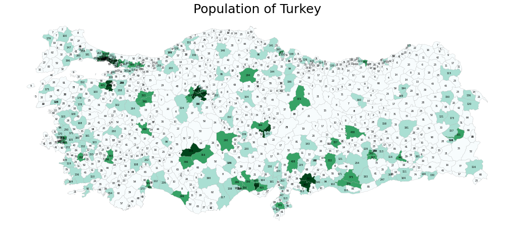
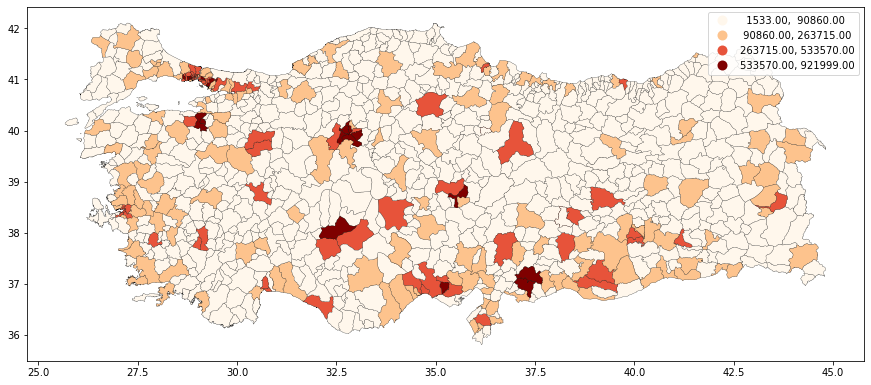
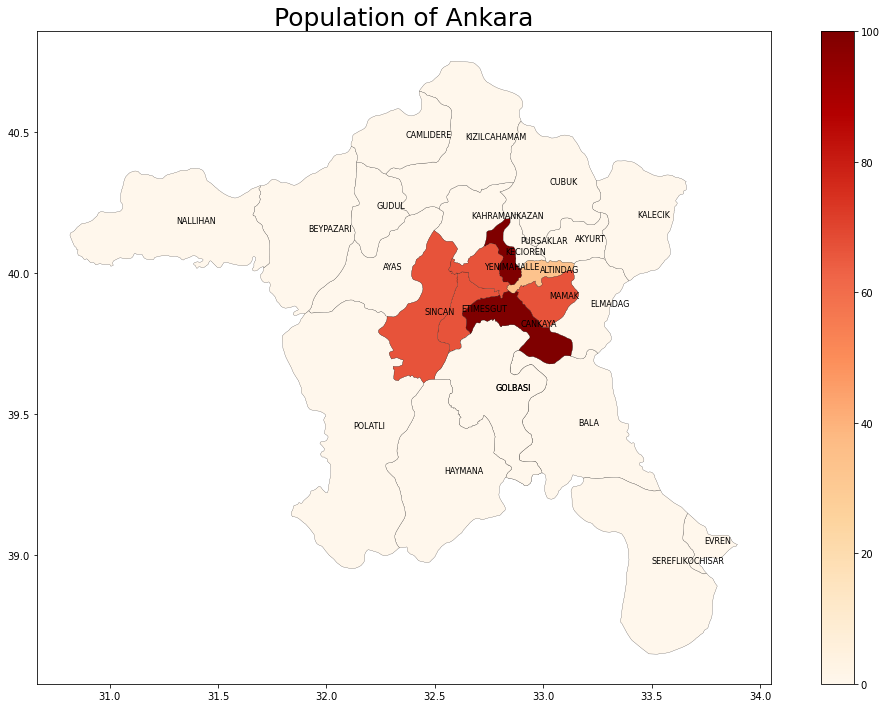
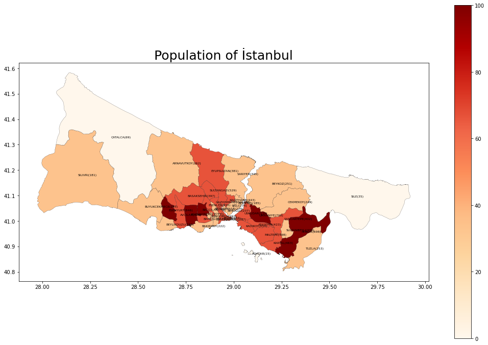

# Cartography-with-Python-Geopandas
Creating Cartography with Python and Geopandas Turkey's Population Heatmaps


```python
variable = 'POP' #POP-Temp
# set the range for the choropleth
vmin, vmax = 100, 1000
# create figure and axes for Matplotlib
fig, ax = plt.subplots(1, figsize=(18, 12))

#adding different type of features
merged.plot(column=variable, scheme='natural_breaks', linewidth=0.2, k=4, cmap='BuGn', ax=ax, edgecolor='0.6', legend=False)
merged.apply(lambda x: ax.annotate(text=round(x['POP']/1000), fontsize=5, xy=x.geometry.centroid.coords[0], va='center', ha='center'), axis=1);

# removing the axis
ax.axis('off')
#merged.head()

# adding a title
ax.set_title('Population of Turkey', fontdict={'fontsize': '25', 'fontweight' : '3'})
```


<br>

```python
merged.plot(column=variable, scheme='natural_breaks', linewidth=0.2, k=4, cmap='OrRd', ax=ax, edgecolor='k', legend=True)
```


<br>

```python
#simple dataframe query
ankara = merged.query('adm1_tr == "ANKARA"')
```


<br>

